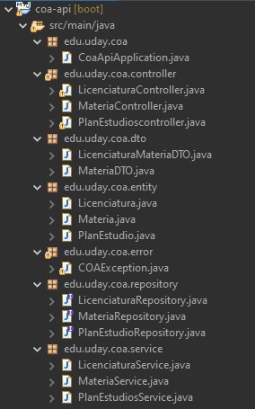

# Principios SOLID en Spring Boot

Los principios SOLID son reglas y mejores prácticas para diseñar clases en programación orientada a objetos. Ayudan a comprender patrones y arquitecturas de software, y son esenciales para los desarrolladores. Estos principios nos guían hacia un código limpio, mantenible y flexible, promoviendo la modularidad, extensibilidad, reutilización y reducción de dependencias entre componentes. SOLID es un acrónimo de cinco principios que mejoran la mantenibilidad, escalabilidad y legibilidad del software.

## Principio de Responsabilidad Única (SRP)

> Una clase debe hacer una cosa y, por lo tanto, debe tener una sola razón para cambiar.

Establece que una clase, componente o microservicio debe tener una única responsabilidad. Esto significa que cada clase debe estar enfocada en realizar una única tarea o funcionalidad. Si una clase tiene múltiples responsabilidades, se vuelve más difícil de entender, mantener y modificar, ya que los cambios en una responsabilidad pueden afectar inadvertidamente a otras responsabilidades.

### Donde vemos este principio

En la estructura que se está utilizando en el proyecto podemos ver paquetes que contienen clases con responsabilidades unicas.
- Entity: Contiene las clases que representa entidades o modelos de datos de la aplicación.
- Controller: Contiene las clases responsables de la interacción con el usuario. Reciben las solicitudes HTTP, procesan los datos necesarios y utilizan otros componentes (servicios) para realizar las operaciones requeridas. 
- Repository: Contiene las interfaces que se encarga de hacer todas las conexiones a la base de datos.
- Service: Contiene las clases que implementan la lógica de negocio de la aplicación
- DTO: Tiene las clases DTO de nuestras entidades donde nosotros vamos a poner solamente la información que vamos a necesitar o que queremos exponer, ya que no debemos exponer las entidades de la base de datos.



Un ejemplo es la clase del paquete controller que son clases controladoras para cada una de nuestras entidades donde tenemos nuestros endpoints, se encargan únicamente de manejar las solicitudes HTTP entrantes, aquí tenemos los métodos get, post, put y delete. Estas clases se encargan de recibir los datos del cliente, interactuar con los servicios correspondientes y devolver las respuestas adecuadas. En este caso la clase LicenciaturaController interactuca con su propio LicenciaturaService.

### **LicenciaturaController-SRP**
```java
package edu.uday.coa.controller;

@RestController
@RequestMapping(value = "/licienciatura")
@Log4j2
public class LicenciaturaController {
    @Autowired
    private LicenciaturaService licenciaturaService;

    @GetMapping
    public ResponseEntity<?> getAllLicenciatura() {
        try {
            return ResponseEntity.ok().body(licenciaturaService.getAllLicenciaturas());
        }catch (COAException ex){
            log.warn("Sin datos");
            log.error(ex);
            return new ResponseEntity<>("datos no encontrados", HttpStatus.OK);
        } catch (Exception e) {
            log.error(e);
            throw new RuntimeException(e);
        }
    }

    @PostMapping
    public Licenciatura createLiceciatura(@RequestBody Licenciatura licenciatura){
        log.info("Kardex  a guardar: "+licenciatura.toString());
        return licenciaturaService.createLicenciatura(licenciatura);
    }

    @PutMapping("/{revoe}")
    public ResponseEntity<?> updateLicenciatura(@RequestBody Licenciatura licenciatura, @PathVariable(value = "revoe")String revoe) {
        log.info("Licenciatura a actualizar :"+licenciatura.toString());
        try {
            return  ResponseEntity.ok().body(licenciaturaService.updateLicenciatura(licenciatura, revoe));
        }catch (COAException ex){
            log.warn("Sin datos");
            log.error(ex);
            return new ResponseEntity<>(ex.getMessage(), HttpStatus.BAD_REQUEST);
        } catch (Exception e) {
            throw new RuntimeException(e);
        }
    }

    @DeleteMapping("/{id}")
    public void deleteKardex(@PathVariable (value = "id") Long id){
         licenciaturaService.deleteLicenciatura(id);
    }
}
```
## Principio de Abierto/Cerrado (OCP)

> Las clases deban estar abiertas a la extensión y cerradas a la modificación.

En otras palabras, una clase debe diseñarse de tal manera que se pueda agregar nueva funcionalidad sin modificar el código existente.

### Donde vemos este principio

En el paquete repository tenemos interfaces que cumplen con la misma responsabilidad, puedo dar un ejemplo con LicenciaturaRepository que cumple con la responsabilidad de realizar operaciones de búsqueda y persistencia en la base de datos para la entidad Licenciatura.  Si se necesita agregar una nueva consulta o método personalizado en el repositorio, se puede hacer agregando un nuevo método sin modificar los métodos existentes. Esto cumple con el principio de Abierto/Cerrado, ya que el repositorio está abierto para su extensión al permitir agregar nuevos métodos sin modificar los existentes.

Además, la interfaz LicenciaturaRepository extiende la interfaz JpaRepository propia de Spring Boot, que proporciona métodos predefinidos, como findAll(), save(), deleteById(), que están diseñados para ser extendidos y personalizados según las necesidades de cada entidad. Al extender JpaRepository, podemos agregar nuestros propios métodos personalizados sin modificar los métodos predefinidos existentes, lo que cumple con el principio de OCP.

### **LicenciaturaRepository-OCP**
```java
public interface LicenciaturaRepository extends JpaRepository <Licenciatura, Long> {
    Optional<Licenciatura> findByRevoe(String revoe);

    Licenciatura findByNombreAndRevoe (String nombre, String revoe);

    @Query("select l from Licenciatura l where l.nombre = :param")
    List<Licenciatura> findByOtherParams (@Param("param") String param);
}
```
## Principio de Sustitución de Liskov (LSP)

> Las clases derivadas deben ser sustituibles por sus clases base.

### Donde vemos este principio

En nuestro proyecto, el cumplimiento de este principio se puede observar en la relación entre las clases Licenciatura, LicenciaturaRepository y LicenciaturaService.

- La clase Licenciatura representa una entidad en el sistema.
- La clase LicenciaturaRepository extiende JpaRepository, que es una interfaz proporcionada por Spring Boot para realizar operaciones de persistencia y búsqueda en la base de datos.
- La clase LicenciaturaService utiliza LicenciaturaRepository para realizar la lógica del negocio.

Aquí es donde se cumple el principio de Sustitución de Liskov:

LicenciaturaRepository al extender JpaRepository puede ser utilizado en lugar de JpaRepository sin alterar el comportamiento esperado de las operaciones de persistencia y búsqueda.
LicenciaturaService al utilizar LicenciaturaRepository como una dependencia, puede trabajar con la interfaz del repositorio sin conocer la implementación concreta. Esto significa que podríamos reemplazar la implementación actual del repositorio sin afectar el funcionamiento del servicio si dicha implementacion cumple con la interfaz LicenciaturaRepository, ya que está programado para trabajar con la interfaz y no depende de los detalles internos de la implementación.

### **LicenciaturaService-LSP**
```java
@Service
@Log4j2
public class LicenciaturaService {
    @Autowired
    private LicenciaturaRepository licenciaturaRepository;

    public Licenciatura createLicenciatura(Licenciatura licenciatura) {
        log.info("crea Licenciatura: " + licenciatura.toString());
        return licenciaturaRepository.save(licenciatura);
    }

    public Licenciatura updateLicenciatura(Licenciatura licenciatura, String revoe) throws Exception {
        Optional<Licenciatura> optionalLicenciatura = licenciaturaRepository.findByRevoe(revoe);
        if (optionalLicenciatura.isPresent()) {
            log.info("actualiza Licenciatura: " + licenciatura.toString());
            return licenciaturaRepository.save(licenciatura);
        }
        throw new COAException("No existe la licenciatura con el revoe");
    }

    public List<Licenciatura> getAllLicenciaturas() throws Exception {
        List<Licenciatura> Licenciaturaes = licenciaturaRepository.findAll();
        if (Licenciaturaes.isEmpty()) {
            throw new COAException("no se encontraron datos");
        }
        return Licenciaturaes;
    }


    public void deleteLicenciatura(Long id) {
        licenciaturaRepository.deleteById(id);
    }
}

```
## Principio de Segregación de la Interfaz (ISP)

> Haz interfaces que sean específicas para un tipo de cliente.

El principio de segregación de interfaces establece que una clase no debe ser forzada a implementar interfaces que no utiliza. En otras palabras, solo se debe exigir a una clase que implemente los métodos que son relevantes para su comportamiento.

### Donde vemos este principio

Este principio se ve reflejado en el proyecto al crear múltiples interfaces de diferentes responsabilidades (Una para cada entidad) en lugar de una sola interfaz grande.
Al crear interfaces separadas para diferentes responsabilidades, nos aseguramos de que las clases services solo implementen los métodos que necesitan, haciendo que el código sea más fácil de mantener y legible.


## Principio de Inversión de Dependencia (DIP)

> Depende de abstracciones, no de clases concretas.

### Donde vemos este principio

Esto podemos lograrlo usando interfaces y usando la inyeccion de dependecias en lugar de instanciar clases concretas. Esto podemos observarlo en las clases de servicio (como LicenciaturaService) dependen de interfaces (como LicenciaturaRepository) en lugar de depender directamente de las implementaciones concretas. Esto se logra mediante el uso de la anotación @Autowired para inyectar las dependencias necesarias en las clases correspondientes. La inversión de dependencia se aplica al utilizar la abstracción de la interfaz LicenciaturaRepository en lugar de depender de una implementación específica.

## **LicenciaturaService-DIP**
```java
@Service
@Log4j2
public class LicenciaturaService {
    @Autowired
    private LicenciaturaRepository licenciaturaRepository;

    public Licenciatura createLicenciatura(Licenciatura licenciatura) {
        log.info("crea Licenciatura: " + licenciatura.toString());
        return licenciaturaRepository.save(licenciatura);
    }
}
```
